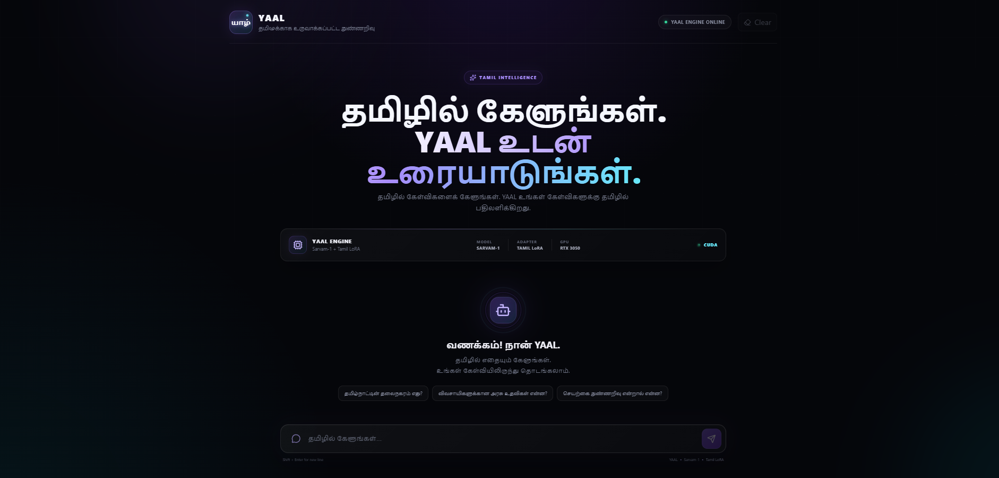
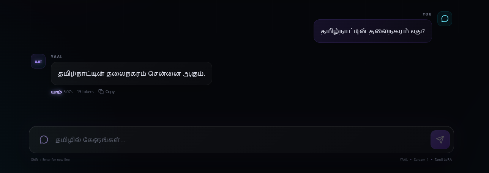
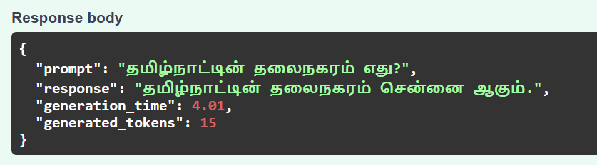

# யாழ் — YAAL

### Tamil Small Language Model Assistant

<p align="center">
  
</p>

<p align="center">
  <strong>தமிழில் கேளுங்கள். YAAL உடன் உரையாடுங்கள்.</strong>
</p>

<p align="center">
  A Tamil-focused AI assistant built using Sarvam-1 and a custom Tamil LoRA adapter.
</p>

<p align="center">


</p>

---

## 🌐 Live Demo

### [YAAL — Live Demo](https://yaal-ai.vercel.app/)

> The web interface is deployed for demonstration. Local GPU inference is used for the YAAL model backend.

---

# 🧠 What is YAAL?

**YAAL** is a Tamil-focused AI assistant built around a fine-tuned Sarvam-1 model.

The project combines a pretrained Indic language model with a Tamil-specific LoRA adapter and a custom web application.

```text
                    YAAL
                     │
          ┌──────────┴──────────┐
          │                     │
     AI Model Stack        Web Application
          │                     │
    Sarvam-1 + LoRA       React + TypeScript
          │                     │
          └──────────┬──────────┘
                     │
                Tamil AI
```

The primary goal is to experiment with building a practical Tamil-oriented Small Language Model application that can run on consumer GPU hardware.

---

# ✨ Features

- 🇮🇳 Tamil-first conversational interface
- 🧠 Sarvam-1 base language model
- 🔗 Custom Tamil LoRA adapter
- ⚡ FastAPI inference backend
- 💻 React + TypeScript + Vite frontend
- 🎮 CUDA GPU acceleration
- 🖥️ Local inference support
- 📊 Generation-time measurement
- 🔢 Generated-token measurement
- 🌐 Web-based chat interface
- 📱 Responsive UI
- 🎨 Custom YAAL visual identity
- 🔌 REST API for model inference

---

# 📸 Screenshots

## YAAL Home



## Tamil Conversation



## API Response



Example API response:

```json
{
  "prompt": "தமிழ்நாட்டின் தலைநகரம் எது?",
  "response": "தமிழ்நாட்டின் தலைநகரம் சென்னை ஆகும்.",
  "generation_time": 4.01,
  "generated_tokens": 15
}
```

---

# 🏗️ System Architecture

```text
┌───────────────────────┐
│         USER          │
│    Tamil Question     │
└───────────┬───────────┘
            │
            ▼
┌───────────────────────┐
│     YAAL FRONTEND     │
│                       │
│ React                  │
│ TypeScript             │
│ Vite                   │
└───────────┬───────────┘
            │
            │ HTTP Request
            ▼
┌───────────────────────┐
│     FASTAPI SERVER    │
│        Python         │
└───────────┬───────────┘
            │
            ▼
┌───────────────────────┐
│       TOKENIZER       │
│   Sarvam Tokenizer    │
└───────────┬───────────┘
            │
            ▼
┌─────────────────────────────┐
│         MODEL STACK         │
│                             │
│        Sarvam-1             │
│             +               │
│       Tamil LoRA            │
└─────────────┬───────────────┘
              │
              ▼
┌───────────────────────┐
│     GPU INFERENCE     │
│   NVIDIA RTX 3050     │
│       6 GB VRAM       │
└───────────┬───────────┘
            │
            ▼
┌───────────────────────┐
│    Tamil Response     │
└───────────┬───────────┘
            │
            ▼
┌───────────────────────┐
│       YAAL UI         │
└───────────────────────┘
```

Detailed architecture:

[`docs/architecture.md`](docs/architecture.md)

---

# 🔬 Model Architecture

YAAL does not represent a completely independent foundation model.

Instead, it uses a **base model + parameter-efficient adaptation** approach.

```text
                Sarvam-1
             Base Language Model
                     │
                     ▼
              Tamil LoRA Adapter
                     │
                     ▼
             YAAL Model Stack
                     │
                     ▼
             FastAPI Inference
                     │
                     ▼
                YAAL UI
```

### Components

| Component | Role |
|---|---|
| Sarvam-1 | Base language model |
| Tamil LoRA | Tamil-focused adaptation |
| PEFT | Parameter-efficient fine-tuning |
| PyTorch | Model execution |
| FastAPI | Inference API |
| React | User interface |
| CUDA | GPU acceleration |

---

# 📊 Sarvam-1 vs YAAL — Experimental Comparison

YAAL was developed by adapting the Sarvam-1 base model with a Tamil-focused LoRA adapter.

The purpose of this comparison is to evaluate the effect of the Tamil fine-tuning by testing the base Sarvam-1 model and YAAL under the same evaluation conditions.

## 🧪 Evaluation Setup

Both models should be evaluated using:

- The same prompts
- The same evaluation dataset
- The same inference environment
- The same generation settings

This section is intended for measured experimental results. Values should be filled from the project's actual evaluation output and should not be estimated.

## 📈 Comparison Results

| Metric | Sarvam-1 | YAAL |
|---|---:|---:|
| Tamil Response Quality | — | — |
| Instruction Following | — | — |
| Tamil Fluency | — | — |
| Factual Accuracy | — | — |
| Average Generation Time | — | — |
| Average Generated Tokens | — | — |

> No comparison values are claimed here until they are taken from the project's actual evaluation results.

## 🔬 Qualitative Comparison

### Example 1

**Prompt**

```text
தமிழ்நாட்டின் தலைநகரம் எது?
```

**Sarvam-1**

```text
[Insert the actual Sarvam-1 response from evaluation]
```

**YAAL**

```text
தமிழ்நாட்டின் தலைநகரம் சென்னை ஆகும்.
```

### Example 2

**Prompt**

```text
[Insert evaluation prompt]
```

**Sarvam-1**

```text
[Insert actual Sarvam-1 response]
```

**YAAL**

```text
[Insert actual YAAL response]
```

## 📊 Comparison Flow

```text
                    Sarvam-1
                       │
                       │
              Tamil LoRA Fine-Tuning
                       │
                       ▼
                      YAAL
                       │
                       ▼
             Same Evaluation Set
                       │
          ┌────────────┴────────────┐
          ▼                         ▼
      Sarvam-1                    YAAL
          │                         │
          └────────────┬────────────┘
                       ▼
                Compare Results
```

---

# 📚 Dataset

The project uses a Tamil-focused supervised fine-tuning dataset.

The dataset preparation process included:

```text
Raw Tamil Data
      │
      ▼
Data Collection
      │
      ▼
Content Cleaning
      │
      ▼
Safety Filtering
      │
      ▼
Quality Filtering
      │
      ▼
Dataset Combination
      │
      ▼
Train / Validation / Test Split
```

## Final Dataset

| Split | Samples |
|---|---:|
| Train | 9,306 |
| Validation | 1,163 |
| Test | 1,164 |
| **Total** | **11,633** |

## Dataset characteristics

The combined dataset contains different types of Tamil instructional and conversational examples, including:

- Chat
- Instruction
- How-to
- Conversational data
- Knowledge-oriented conversations
- Tamil instruction-following examples

---

# 🧹 Dataset Processing

The Tamil data preparation pipeline included:

### 1. Collection

Tamil samples were collected from multiple datasets.

### 2. Cleaning

Low-quality and problematic content was removed.

### 3. Filtering

Safety and content-quality filtering was applied.

### 4. Combination

The cleaned datasets were combined into a unified Tamil SFT dataset.

### 5. Splitting

The final dataset was divided into:

```text
Train       → 9,306
Validation  → 1,163
Test        → 1,164
```

---

# 🧪 Training Pipeline

```text
Tamil Datasets
      │
      ▼
Data Collection
      │
      ▼
Cleaning & Filtering
      │
      ▼
Tamil SFT Dataset
      │
      ▼
Train / Validation / Test
      │
      ├─────────────────┐
      │                 │
      ▼                 ▼
Sarvam-1            Tamil Dataset
Base Model               │
      │                  │
      └────────┬─────────┘
               ▼
          LoRA / PEFT
               │
               ▼
          Fine-Tuning
               │
               ▼
        Tamil LoRA Adapter
               │
               ▼
        Hugging Face Hub
               │
               ▼
          YAAL Backend
               │
               ▼
        GPU Inference
```

Detailed training documentation:

[`docs/training-pipeline.md`](docs/training-pipeline.md)

---

# ⚙️ Fine-Tuning

YAAL uses **parameter-efficient fine-tuning** rather than modifying the entire base model.

### Approach

```text
Base Model
   +
Tamil SFT Dataset
   ↓
LoRA / PEFT
   ↓
Train Adapter Parameters
   ↓
Save LoRA Adapter
   ↓
Load Adapter with Base Model
```

This approach reduces the number of parameters that need to be updated during training compared with full-model fine-tuning.

---

# 🤖 Model Specifications

| Specification | YAAL |
|---|---|
| Base Model | Sarvam-1 |
| Adaptation | Tamil LoRA |
| Fine-Tuning | PEFT / LoRA |
| Framework | PyTorch |
| Tokenizer | Sarvam tokenizer |
| Backend | FastAPI |
| Runtime | Uvicorn |
| GPU | NVIDIA GeForce RTX 3050 |
| VRAM | 6 GB |
| CUDA | Enabled |
| Inference | Local GPU |

---

# 💻 Hardware

YAAL was developed and tested using consumer GPU hardware.

### Local GPU

```text
GPU:
NVIDIA GeForce RTX 3050 Laptop GPU

VRAM:
6 GB

CUDA:
Enabled
```

---

# 🚀 Installation

## 1. Clone the repository

```bash
git clone https://github.com/Nithiarasu06/yaal-ai.git
cd yaal-ai
```

---

# 🐍 Backend Setup

Go to the backend:

```bash
cd backend
```

Install Python dependencies:

```bash
pip install -r requirements.txt
```

Start the backend:

```bash
python main.py
```

The FastAPI server should run at:

```text
http://127.0.0.1:8000
```

---

# 🌐 Frontend Setup

Open another terminal.

From the project root:

```bash
cd frontend
```

Install dependencies:

```bash
npm install
```

Start the development server:

```bash
npm run dev
```

Open:

```text
http://localhost:5173
```

---

# 🔌 API

YAAL exposes model inference through a FastAPI endpoint.

## Example Request

```json
{
  "prompt": "தமிழ்நாட்டின் தலைநகரம் எது?"
}
```

## Example Response

```json
{
  "prompt": "தமிழ்நாட்டின் தலைநகரம் எது?",
  "response": "தமிழ்நாட்டின் தலைநகரம் சென்னை ஆகும்.",
  "generation_time": 4.01,
  "generated_tokens": 15
}
```

---

# 📊 Inference Metrics

YAAL records basic generation metrics.

### Generation Time

The API reports the time taken to generate a response.

Example:

```text
generation_time: 4.01 seconds
```

### Generated Tokens

The API also reports the number of generated tokens.

Example:

```text
generated_tokens: 15
```

These measurements can be used for future performance benchmarking.

---

# 🖥️ Frontend

The YAAL frontend was built using:

```text
React
   +
TypeScript
   +
Vite
```

The interface provides:

- Tamil-first chat experience
- Responsive layout
- Model status
- Generation information
- Copy response functionality
- Regeneration interface
- YAAL branding
- Dark AI-oriented visual design

---

# 🛠️ Technology Stack

## AI / ML

- Python
- PyTorch
- Transformers
- PEFT
- LoRA
- BitsAndBytes
- CUDA

## Backend

- FastAPI
- Uvicorn

## Frontend

- React
- TypeScript
- Vite
- Framer Motion
- Lucide React

## Development

- Git
- GitHub
- VS Code
- Hugging Face

---

# 📁 Project Structure

```text
yaal-ai/
│
├── backend/
│   ├── main.py
│   └── requirements.txt
│
├── frontend/
│   ├── public/
│   │   ├── yaal.svg
│   │   ├── favicon.svg
│   │   └── icons.svg
│   │
│   ├── src/
│   │   ├── App.tsx
│   │   ├── App.css
│   │   ├── index.css
│   │   └── main.tsx
│   │
│   ├── package.json
│   ├── package-lock.json
│   └── vite.config.ts
│
├── docs/
│   ├── screenshots/
│   │   ├── home.png
│   │   ├── chat.png
│   │   └── api.png
│   │
│   ├── architecture.md
│   └── training-pipeline.md
│
├── package.json
├── package-lock.json
├── .gitignore
└── README.md
```

---

# 🧩 Why LoRA?

Full fine-tuning requires updating a very large number of model parameters.

LoRA instead introduces trainable low-rank adapter parameters while keeping most of the original model weights unchanged.

```text
Traditional Fine-Tuning

Base Model
    ↓
Update Model Parameters
    ↓
New Full Model
```

```text
YAAL

Base Model
    +
Small Trainable LoRA Adapter
    ↓
Tamil Adaptation
```

This makes parameter-efficient experimentation more practical on limited hardware.

---

# 🔄 Inference Flow

When a user asks a question:

```text
1. User enters Tamil question
             ↓
2. React frontend sends API request
             ↓
3. FastAPI receives prompt
             ↓
4. Tokenizer processes input
             ↓
5. Sarvam-1 + Tamil LoRA generate tokens
             ↓
6. GPU performs inference
             ↓
7. Generated text is returned
             ↓
8. Frontend displays Tamil response
```

---

# 📌 Example

### User

```text
தமிழ்நாட்டின் தலைநகரம் எது?
```

### YAAL

```text
தமிழ்நாட்டின் தலைநகரம் சென்னை ஆகும்.
```

---

# 📈 Current Project Status

| Component | Status |
|---|---|
| Tamil dataset preparation | ✅ Complete |
| Data cleaning | ✅ Complete |
| Dataset splitting | ✅ Complete |
| Sarvam-1 integration | ✅ Complete |
| Tamil LoRA integration | ✅ Complete |
| Local GPU inference | ✅ Complete |
| FastAPI backend | ✅ Complete |
| React frontend | ✅ Complete |
| Tamil chat interface | ✅ Complete |
| GitHub repository | ✅ Complete |
| Web interface deployment | ✅ Complete |
| Model evaluation | 🔄 Ongoing |
| Performance optimization | 🔄 Ongoing |
| Larger-scale evaluation | 🔄 Planned |

---

# 🔮 Future Work

### Model

- Improved Tamil instruction tuning
- Higher-quality Tamil datasets
- More extensive evaluation
- Tamil benchmark creation
- Better conversational consistency

### Performance

- Inference optimization
- Reduced generation latency
- Memory optimization
- Quantization experiments
- Streaming generation

### Application

- Conversation memory
- Better error handling
- Improved mobile interface
- Tamil voice input
- Tamil text-to-speech
- More language support

### Evaluation

Future evaluation will examine:

- Tamil fluency
- Instruction following
- Factual accuracy
- Response consistency
- Generation latency
- Token throughput

---

# ⚠️ Limitations

YAAL is an experimental student/research project.

The current system has several limitations:

- Limited training dataset size
- Consumer GPU constraints
- Limited formal benchmark evaluation
- Generation latency depends on local hardware
- Model responses may contain factual errors
- Tamil linguistic quality may vary depending on the prompt

YAAL should therefore be treated as an experimental AI system rather than a production-grade general-purpose language model.

---

# 🎯 Project Objectives

The project aims to explore:

```text
Tamil NLP
   +
Small Language Models
   +
Parameter-Efficient Fine-Tuning
   +
GPU Inference
   +
Full-Stack AI Applications
```

The broader objective is to understand the complete lifecycle of a language-model application:

```text
Dataset
   ↓
Cleaning
   ↓
Fine-Tuning
   ↓
Model Adapter
   ↓
Inference
   ↓
API
   ↓
Frontend
   ↓
Deployment
```

---

# 🌱 Learning Outcomes

This project provides practical experience with:

- Large language model adaptation
- Tamil NLP
- Supervised fine-tuning
- LoRA / PEFT
- Hugging Face tooling
- PyTorch
- GPU inference
- FastAPI
- React
- TypeScript
- REST APIs
- Git and GitHub
- AI application deployment

---

# 👨‍💻 Author

## Nithiarasu

AI & Data Science Student

GitHub:

https://github.com/Nithiarasu06

Project:

https://github.com/Nithiarasu06/yaal-ai

---

# 📜 License

This project is currently intended for educational and research purposes.

A formal open-source license can be added as the project develops.

---

# 🙏 Acknowledgements

YAAL builds on open-source technologies and models from the broader AI/ML ecosystem.

Special thanks to the developers and researchers behind:

- Sarvam AI
- Hugging Face
- PyTorch
- Transformers
- PEFT
- FastAPI
- React
- Vite

---

<p align="center">

### யாழ்

**தமிழில் கேளுங்கள். YAAL உடன் உரையாடுங்கள்.**

Built with ❤️ for Tamil AI.

</p>
