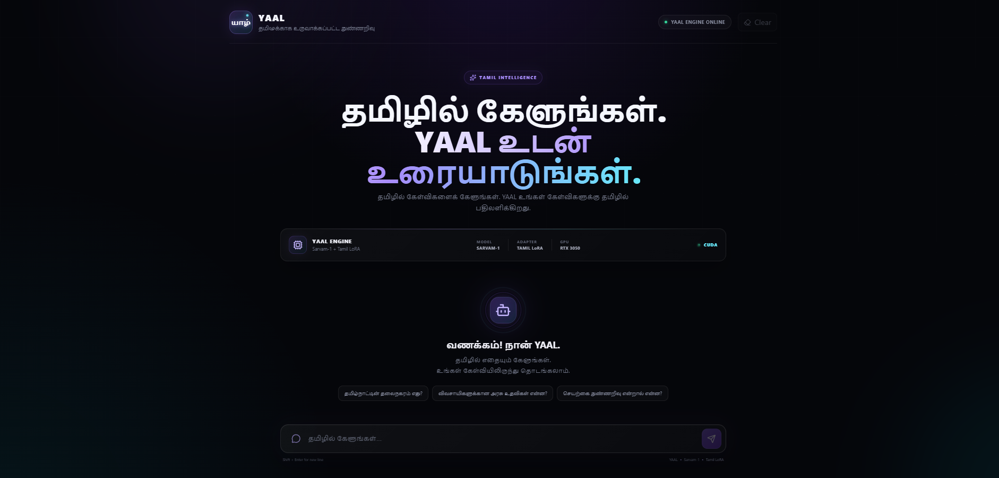
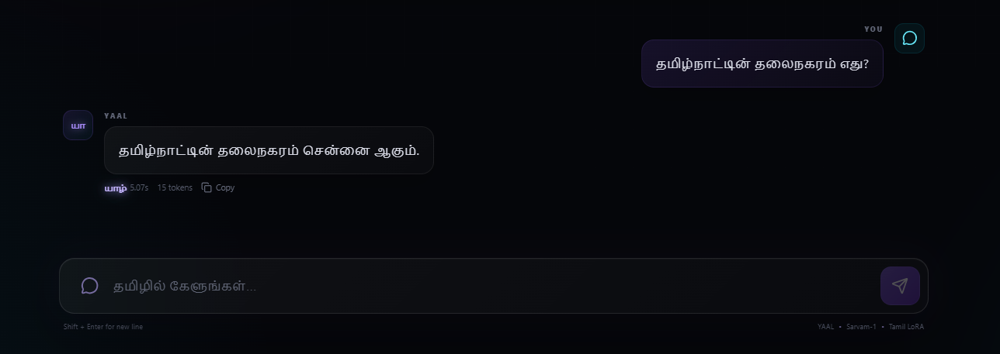
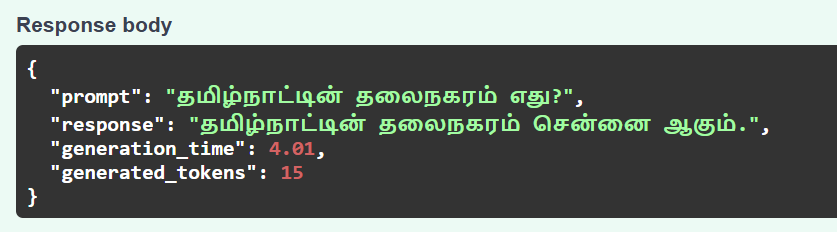

# YAAL — தமிழ் AI

<p align="center">
  
</p>

<h3 align="center">தமிழில் கேளுங்கள். YAAL உடன் உரையாடுங்கள்.</h3>

<p align="center">
  A Tamil-focused language model application powered by Sarvam-1 with Tamil LoRA adaptation.
</p>

<p align="center">
  <a href="https://github.com/Nithiarasu06/yaal-ai">GitHub</a> •
  <a href="https://yaal-ai.vercel.app/">Live Demo</a>
</p>

---

## 📌 Overview

**YAAL** is a Tamil-focused AI assistant built to experiment with Tamil language adaptation, local inference, and an end-to-end LLM application stack.

The project combines:

- **Sarvam-1** as the base language model
- **Tamil LoRA / PEFT** for parameter-efficient adaptation
- A curated Tamil instruction dataset
- **FastAPI** backend for inference
- **React + TypeScript + Vite** frontend
- Local **NVIDIA RTX 3050 6 GB** inference
- A dedicated Tamil chat interface
- A documented evaluation pipeline for comparing the adapted model with the base model

> **Important:** YAAL is a project/model adaptation built on Sarvam-1. It is not presented as a new foundation model trained from scratch.

---

# 🧠 Model

## Base Model

**Sarvam-1**

YAAL uses Sarvam-1 as its base model and applies a Tamil LoRA adapter through PEFT.

### YAAL configuration

| Property | YAAL |
|---|---:|
| Base model | Sarvam-1 |
| Adaptation | Tamil LoRA |
| Fine-tuning method | LoRA / PEFT |
| Total parameters | 2,549,057,536 |
| Trainable parameters | 23,969,792 |
| Trainable percentage | 0.9403% |
| Maximum sequence length used | 768 tokens |
| Inference hardware | NVIDIA RTX 3050 6 GB |
| Backend | FastAPI |
| Frontend | React + TypeScript + Vite |

The reported parameter counts are from the YAAL training setup.

---

# 📚 Dataset

YAAL's training data combines cleaned Tamil instruction-style data from two sources used during development.

### Dataset preparation

| Dataset stage | Samples |
|---|---:|
| Indic SFT Tamil extracted | 8,000 |
| Indic SFT Tamil after cleaning | 7,993 |
| Indic SFT Tamil final | 7,935 |
| VAZHI original | 5,328 |
| VAZHI after safety filtering | 3,698 |
| Combined dataset before deduplication | 11,633 |
| Final combined samples | 11,633 |

### Final split

| Split | Samples |
|---|---:|
| Training | 9,306 |
| Validation | 1,163 |
| Test | 1,164 |
| **Total** | **11,633** |

**Random seed:** `42`

### Task distribution

| Task | Samples |
|---|---:|
| Chat | 3,749 |
| Instruction | 2,994 |
| How-to | 1,250 |

The remaining dataset characteristics are documented in the project documentation.

---

# 🔧 Training

YAAL uses parameter-efficient fine-tuning rather than updating all model parameters.

### Training approach

```text
Tamil datasets
      │
      ▼
Data cleaning
      │
      ▼
Safety filtering
      │
      ▼
Dataset combination
      │
      ▼
Train / Validation / Test split
      │
      ▼
Sarvam-1
      │
      ▼
Tamil LoRA / PEFT
      │
      ▼
YAAL adapter
      │
      ▼
Local inference
```

This approach keeps the number of trainable parameters relatively small compared with the full model.

More details:

- [`docs/training-pipeline.md`](docs/training-pipeline.md)
- [`docs/architecture.md`](docs/architecture.md)

---

# 🏗️ Architecture

```text
┌───────────────────────────────┐
│       React + TypeScript      │
│          Vite Frontend        │
└───────────────┬───────────────┘
                │ HTTP
                ▼
┌───────────────────────────────┐
│          FastAPI API          │
│       Inference Endpoint      │
└───────────────┬───────────────┘
                │
                ▼
┌───────────────────────────────┐
│          YAAL Engine           │
│                               │
│       Sarvam-1 + Tamil LoRA   │
└───────────────┬───────────────┘
                │
                ▼
┌───────────────────────────────┐
│     NVIDIA RTX 3050 6 GB      │
│       Local GPU Inference     │
└───────────────────────────────┘
```

See [`docs/architecture.md`](docs/architecture.md).

---

# 💻 Technology Stack

### AI / ML

- Python
- PyTorch
- Hugging Face Transformers
- PEFT / LoRA
- Datasets
- Sarvam-1

### Backend

- FastAPI
- Uvicorn
- Python

### Frontend

- React
- TypeScript
- Vite
- CSS

### Development

- Git
- GitHub
- NVIDIA CUDA
- Local GPU inference

---

# 🖥️ Screenshots

## 🏠 YAAL Home

<p align="center">
  
</p>

## 💬 Tamil Conversation

<p align="center">
  
</p>

## 🔌 API Response

<p align="center">
  
</p>

---

# ⚡ Example Inference

Example prompt:

```text
தமிழ்நாட்டின் தலைநகரம் எது?
```

Example YAAL response:

```text
தமிழ்நாட்டின் தலைநகரம் சென்னை ஆகும்.
```

One observed local API response during development:

```json
{
  "prompt": "தமிழ்நாட்டின் தலைநகரம் எது?",
  "response": "தமிழ்நாட்டின் தலைநகரம் சென்னை ஆகும்.",
  "generation_time": 4.01,
  "generated_tokens": 15
}
```

This is **one observed inference**, not an average benchmark result.

The corresponding throughput for this observation is approximately:

```text
15 / 4.01 ≈ 3.74 tokens/second
```

> This value should not be treated as a final model benchmark until it is measured over a controlled evaluation set.

---

# 📊 Model Evaluation

## Sarvam-1 vs YAAL

The objective of the evaluation is to compare the **base Sarvam-1 model** and **YAAL (Sarvam-1 + Tamil LoRA)** under the same conditions.

The comparison should use:

- The same test prompts
- The same hardware
- The same tokenizer
- The same generation parameters
- The same maximum output length
- The same number of runs
- The same evaluation procedure

### Current status

The controlled benchmark has **not yet been completed**.

| Metric | Sarvam-1 | YAAL | Status |
|---|---:|---:|---|
| Tamil response quality | Not measured | Not measured | 🔄 To evaluate |
| Instruction following | Not measured | Not measured | 🔄 To evaluate |
| Tamil fluency | Not measured | Not measured | 🔄 To evaluate |
| Factual accuracy | Not measured | Not measured | 🔄 To evaluate |
| Average generation time | Not measured | Not measured | 🔄 To benchmark |
| Average generated tokens | Not measured | Not measured | 🔄 To benchmark |
| Tokens / second | Not measured | Not measured | 🔄 To benchmark |
| GPU memory usage | Not measured | Not measured | 🔄 To benchmark |

### Model configuration comparison

| Property | Sarvam-1 | YAAL |
|---|---|---|
| Base model | Sarvam-1 | Sarvam-1 |
| Tamil adaptation | Base model | Tamil LoRA |
| Fine-tuning | — | LoRA / PEFT |
| Total parameters | Base model | 2,549,057,536 |
| Trainable parameters | — | 23,969,792 |
| Trainable percentage | — | 0.9403% |
| Maximum sequence length used by YAAL | — | 768 tokens |
| Local inference | To be measured | Tested |
| Controlled benchmark | Not measured | Not measured |

> **No performance winner is claimed at this stage.** Numerical comparison values will be added after controlled evaluation.

---

# 🧪 How YAAL Should Be Evaluated

A reproducible evaluation can be performed using a fixed Tamil test set.

## 1. Build a test set

Create approximately **100–300 Tamil prompts** covering several categories:

```text
General knowledge
Factual QA
Instruction following
Summarization
Translation
Tamil grammar
Tamil conversation
Reasoning
How-to questions
Safety / refusal cases
```

For example:

```text
தமிழ்நாட்டின் தலைநகரம் எது?

கீழ்கண்ட வாக்கியத்தை சுருக்கமாக எழுதுங்கள்:
...

இந்த உரையை ஆங்கிலத்தில் மொழிபெயர்க்கவும்:
...

தமிழில் ஒரு சிறிய மழைக்காலக் கவிதை எழுதுங்கள்.
```

Keep the exact same prompts for both models.

## 2. Run Sarvam-1

Run the base model without the YAAL Tamil LoRA adapter.

Record:

```text
prompt
response
generation_time
generated_tokens
tokens_per_second
GPU_memory
```

## 3. Run YAAL

Run exactly the same prompts with the Tamil LoRA adapter.

Record the same measurements.

## 4. Measure generation performance

For each prompt:

```text
tokens_per_second =
generated_tokens / generation_time
```

Then calculate:

```text
average_generation_time
average_generated_tokens
average_tokens_per_second
```

For more reliable timing, discard the first warm-up run and run each prompt multiple times if practical.

## 5. Evaluate response quality

For human evaluation, use a fixed rubric such as:

| Criterion | Suggested scale |
|---|---:|
| Tamil fluency | 1–5 |
| Factual accuracy | 1–5 |
| Instruction following | 1–5 |
| Relevance | 1–5 |
| Overall response quality | 1–5 |

The same evaluator and rubric should be used for both models.

## 6. Add the real results

After evaluation, replace:

```text
Not measured
```

with the actual measured values.

For example:

```text
| Average generation time | <measured value> | <measured value> |
| Tokens / second | <measured value> | <measured value> |
```

Do not enter estimated or manually selected values.

---

# 📈 Recommended Evaluation Report

The final evaluation should contain three parts.

### Quantitative

```text
Average generation time
Average tokens generated
Tokens / second
GPU memory usage
```

### Qualitative

```text
Tamil fluency
Instruction following
Factual accuracy
Relevance
Overall quality
```

### Error analysis

Document examples where either model:

- Produces an incorrect fact
- Uses unnatural Tamil
- Fails to follow an instruction
- Produces irrelevant content
- Repeats text
- Stops unexpectedly
- Mixes Tamil and English unnecessarily

This makes the evaluation more useful than a single aggregate score.

---

# 📋 Current Project Status

| Component | Status |
|---|---|
| Tamil dataset preparation | ✅ Complete |
| Data cleaning | ✅ Complete |
| Dataset splitting | ✅ Complete |
| Sarvam-1 integration | ✅ Complete |
| Tamil LoRA integration | ✅ Complete |
| Local GPU inference | ✅ Complete |
| FastAPI backend | ✅ Complete |
| React frontend | ✅ Complete |
| Tamil chat interface | ✅ Complete |
| GitHub repository | ✅ Complete |
| Web interface deployment | ✅ Complete |
| Controlled model evaluation | 🔄 Ongoing |
| Performance benchmarking | 🔄 Ongoing |
| Larger-scale evaluation | 📋 Planned |

---

# 🚀 Running YAAL Locally

## Clone

```bash
git clone https://github.com/Nithiarasu06/yaal-ai.git
cd yaal-ai
```

## Backend

```bash
cd backend
pip install -r requirements.txt
```

Start the FastAPI server according to the backend configuration.

## Frontend

```bash
cd frontend
npm install
npm run dev
```

The frontend communicates with the inference backend through the configured API endpoint.

---

# 📁 Project Structure

```text
yaal-ai/
│
├── backend/
│   ├── main.py
│   └── requirements.txt
│
├── frontend/
│   ├── public/
│   └── src/
│       ├── App.tsx
│       ├── App.css
│       ├── index.css
│       └── main.tsx
│
├── docs/
│   ├── architecture.md
│   ├── training-pipeline.md
│   └── screenshots/
│       ├── home.png
│       ├── chat.png
│       └── api.png
│
├── README.md
├── package.json
└── .gitignore
```

---

# 🌐 Live Demo

**YAAL Web Interface**

https://yaal-ai.vercel.app/

The live interface demonstrates the YAAL frontend. Local GPU inference remains part of the development/deployment architecture unless a remote inference service is configured.

---

# 🎯 Project Goals

YAAL is intended to explore:

- Tamil language model adaptation
- Parameter-efficient fine-tuning
- Tamil instruction datasets
- Local LLM inference
- GPU-constrained inference
- Tamil conversational interfaces
- Reproducible model evaluation
- End-to-end AI application development

---

# 🔬 Future Work

- [ ] Complete controlled Sarvam-1 vs YAAL benchmark
- [ ] Expand Tamil evaluation dataset
- [ ] Automated evaluation pipeline
- [ ] Human evaluation study
- [ ] Detailed error analysis
- [ ] Generation-speed optimization
- [ ] Memory optimization
- [ ] Larger-scale Tamil evaluation
- [ ] Improved deployment architecture
- [ ] Additional Tamil instruction data
- [ ] Model quantization experiments

---

# ⚠️ Limitations

YAAL is an experimental Tamil language-model adaptation.

Current limitations include:

- The controlled Sarvam-1 vs YAAL benchmark is not yet complete.
- The current performance numbers are observations from development rather than statistically aggregated benchmarks.
- Local inference is constrained by the available GPU memory.
- Model quality can vary depending on prompt type.
- The current evaluation does not establish superiority over the base model.

---

# 📜 License

Add the project's intended license here before distributing the repository publicly.

The underlying model, datasets, libraries, and other third-party components remain subject to their respective licenses and terms.

---

# 👨‍💻 Author

**Nithiarasu**

AI & Data Science Student

GitHub:  
https://github.com/Nithiarasu06

---

<p align="center">
  <b>YAAL</b><br>
  தமிழ் மொழிக்கான ஒரு பரிசோதனை AI திட்டம்.
</p>
